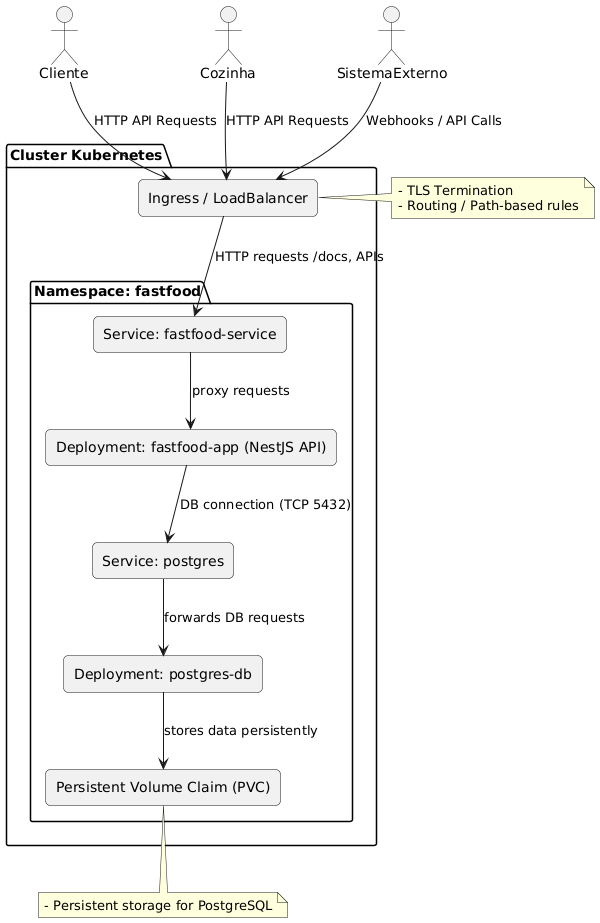
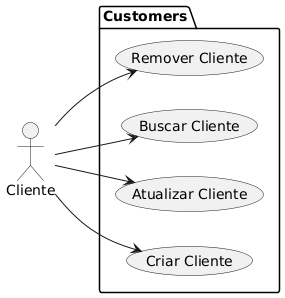
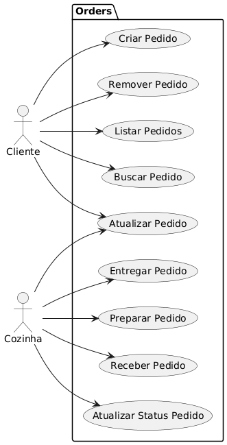
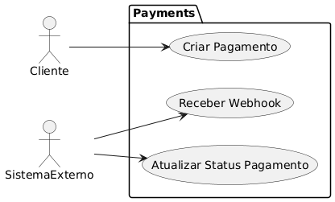

# FastFood API 🍔

API REST para sistema de autoatendimento de lanchonete, desenvolvida em TypeScript com NestJS e arquitetura limpa (Clean Architecture). Projeto da Fase 2 do SOAT Tech Challenge.

## 🚀 Tecnologias

- **Backend**: NestJS + TypeScript
- **Banco de Dados**: PostgreSQL
- **ORM**: TypeORM
- **Documentação**: Swagger/OpenAPI
- **Containerização**: Docker

## 📋 Pré-requisitos

- Node.js (v22.16.0 ou superior)
- Docker e Docker Compose
- npm

## 🔧 Instalação local para desenvolvimento

1. Clone o repositório
```bash
git clone https://github.com/MatheusBezerra414/fastfood.git
cd fastfood
```


2. Instale as dependências
```bash
npm install
```

3. Configure as variáveis de ambiente
```bash
cp .env.example .env
```

4. Inicie apenas o banco de dados PostgreSQL
```bash
docker compose up postgres -d
```

5. Popule o banco com dados iniciais
```bash
npm run seed:build
```

6. Inicie o servidor em modo desenvolvimento (com hot-reload)
```bash
npm run start:dev
```

## 🐳 Simulando Produção

Para simular um ambiente de produção, você pode usar a infra estrutura do Kubernets para subir toda a aplicação:

```bash
# Clone o repositório
git clone https://github.com/fastfood-tc/fastfood.git
cd fastfood

# Configure as variáveis de ambiente
cp .env.example .env

# Inicie todos os serviços com os K8S (API + PostgreSQL)
./infra/k8s/apply.sh
```

Verifique os pods em execução
```bash
kubectl get pods
```

Acesse a API via serviço:
```bash
minikube service fastfood-service --url
```

## 📚 Documentação

A API poderá estar disponível em `http://localhost:3000` e a documentação (Swagger) em `http://localhost:3000/docs`.

## 🏗️ Arquitetura

O projeto segue a Arquitetura Limpa (Clean Architecture) com os seguintes módulos:

- **Customers**: Gestão de clientes
- **Products**: Catálogo de produtos
- **Order-item**: Produtos selecionados para processamento
- **Orders**: Processamento de pedidos
- **Payments**: Integração com gateway de pagamento

## 🛠️ Scripts Disponíveis

- `npm run start:dev`: Inicia o servidor em modo desenvolvimento (com hot-reload)
- `npm run build`: Compila o projeto
- `npm run start:prod`: Inicia o servidor em modo produção
- `npm run seed:build`: Popula o banco com dados iniciais
- `npm run lint`: Executa o linter
- `npm run format`: Formata o código

## Arquitetura do Sistema

### Diagrama de Arquitetura Geral



Este diagrama mostra a arquitetura do sistema com os principais componentes:
- Kubernetes com Minikube ou cluster real
- Deployments e Services para API NestJS e PostgreSQL
- Ingress para exposição externa
- Volumes persistentes para o banco de dados
- Comunicação dos atores (Cliente, Cozinha e Sistemas Externos)

---

### Diagramas de Use Cases por Módulo

Cada módulo tem um diagrama de use case específico para representar seus casos de uso principais.

**Clientes:**



**Pedidos:**



**Pagamentos:**




## 📝 Licença

Este projeto foi desenvolvido como parte do SOAT Tech Challenge.